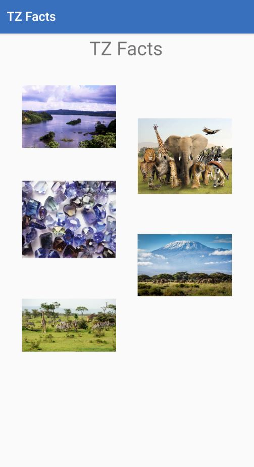

# aad-team-55-animation-challenge
AAD Challenge II

aad-team-55-animation-challenge is an app that briefly describe five Tanzania's facts,
These five categories were randomly selected, just to demonstrate a few things and animation tricks we learned from Android Animations Course by Sriyank Siddhartha (https://app.pluralsight.com/library/courses/android-animations-update/table-of-contents) 

#Categories
1. _Mountains_
   - Kilimanjaro
   - Meru
   - Usambara

2. _Animals_
   - Simba (Lion)
   - Elephant
   - Giraffe

3. _Lakes_
   - Victoria
   - Tanganyika
   - Nyasa

4. _Minerals_
   - Tanzanite
   - Gold
   - Diamond

5. _National Parks_
   - Serengeti
   - Ngorongoro
   - Mikumi

Contributors:
List of contributors: [Contributors](Contributors.md)